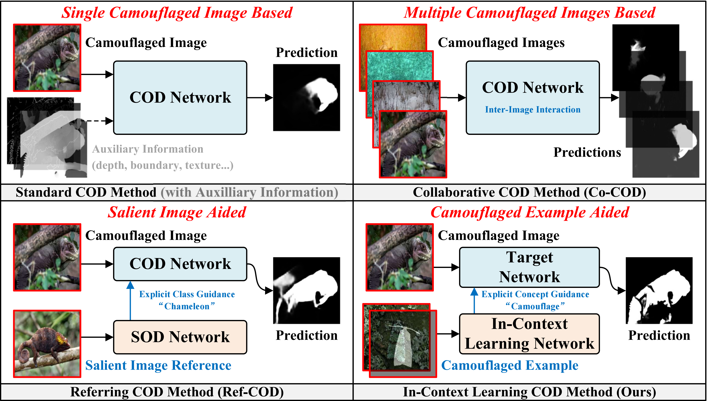
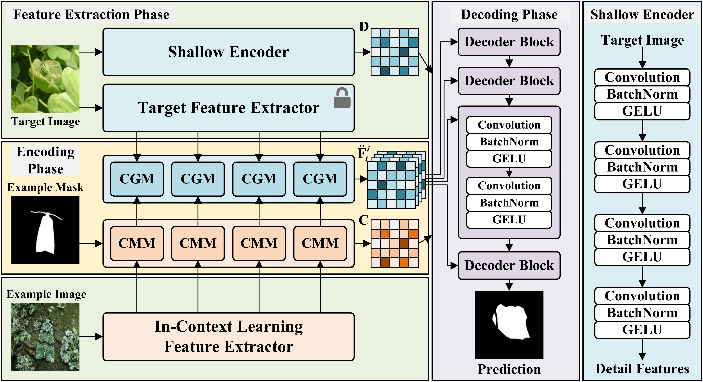
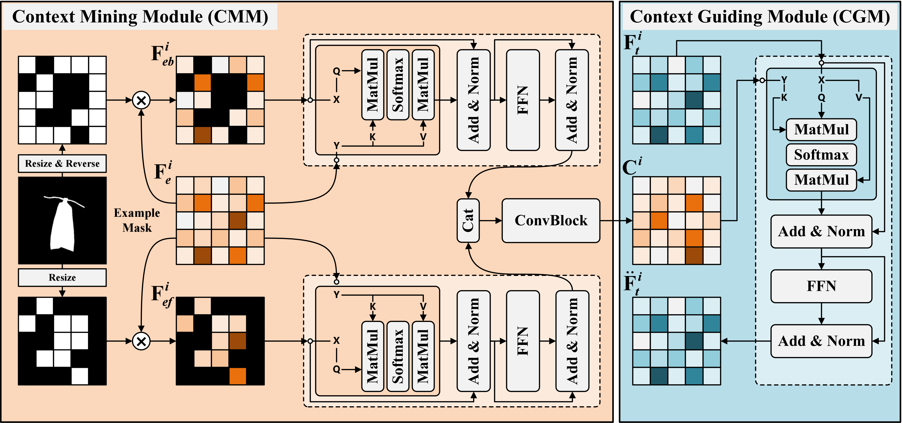
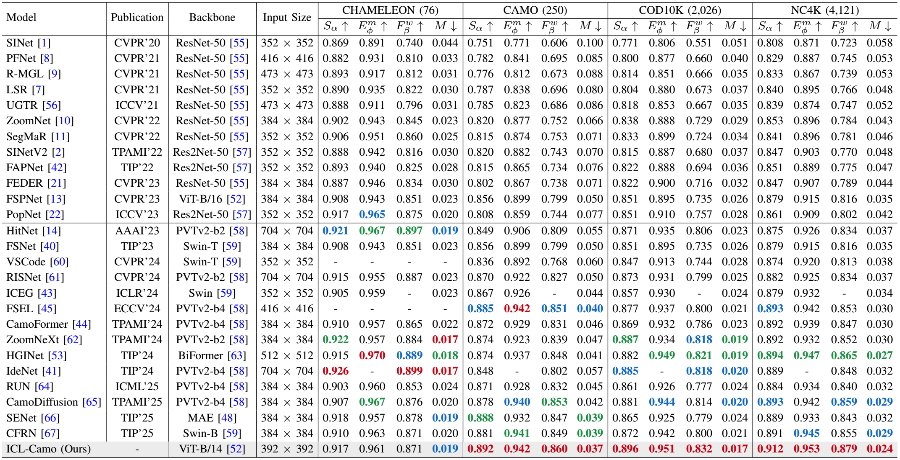
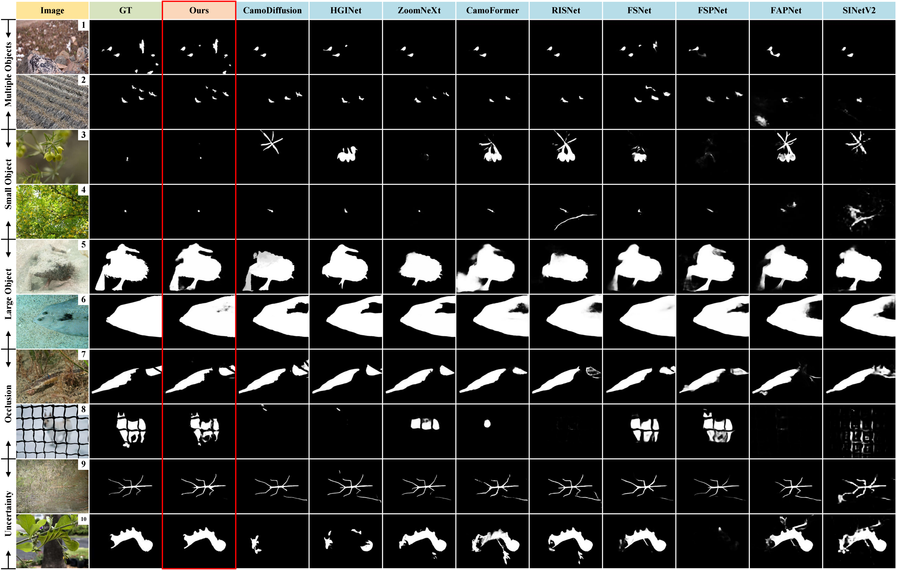

# Learn from Examples: In-Context Learning for Camouflaged Object Detection (Under Review)

> **Authors:**
> Chunyuan Chen,
> Weiyun Liang,
> Ji Du,
> Jing Xu*,
> Ping Li*,
> and Guiling Wang.

## 1. Overview

- This repository provides code for "_**Learn from Examples: In-Context Learning for Camouflaged Object Detection**_", Under Review. [Paper]() 

### 1.1 Introduction

Recently, new paradigms of camouflage object detection (COD), such as referring-COD (Ref-COD) and collaborative-COD (Co-COD), have been proposed to enhance task performance. However, there remains a lack of in-depth exploration of how to utilize reference information more effectively. In this paper, we introduce in-context learning camouflaged object detection (ICL-COD) as a novel paradigm of COD, which leverages camouflaged image samples and their corresponding annotations as visual examples to guide the model in better perceiving camouflage and recognizing camouflaged objects. We propose the ICL-Camo network, with the design of a context mining module (CMM) to mine fine-grained contextual information contained in the visual examples, and a context guiding module (CGM) that utilizes the contextual information mined from the examples as guidance to shift the attention of the target image features on potential camouflaged regions, thus enhancing its perception of camouflaged objects. Extensive experiments conducted on the COD benchmarks and other relevant tasks demonstrate the effectiveness of our proposed ICL-COD paradigm and ICL-Camo network.

      
    <em> 
    <b>Figure 1:</b> <b>Different paradigms of COD.</b> <b>Standard COD</b> takes a single camouflaged image (possibly with auxiliary information) as input. <b>Ref-COD</b> leverages a camouflaged image, combined with a salient image that contains a specific category of object for explicit class guidance. <b>Co-COD</b> leverages a batch of camouflaged images to interact within images. Our proposed <b>ICL-COD</b> leverages a target camouflaged image, and an example consists of a camouflaged image, along with its corresponding annotations, providing explicit concept guidance of camouflage.
    </em>

### 1.2 Framework

      
    <em> 
    <b>Figure 2:</b> Overview of the proposed ICL-Camo network. It consists of three phases: feature extraction, encoding, and decoding phases, where the target image feature extraction phase additionally includes a shallow encoder for extracting detail features. <b>CMM:</b> Context mining module. <b>CGM:</b> Context guiding module.
    </em>

      
    <em> 
    <b>Figure 3:</b> Detailed structure of the proposed context mining module (CMM) and context guiding module (CGM). <b>⊗:</b> Element-wise multiplication. <b>Cat:</b> Channel-wise concatenation.
    </em>

### 1.3 Quantitative Results

      
    <em> 
    <b>Table 1:</b> Qualitative comparisons with different methods on our COD datasets. The 1st, 2nd, and 3rd best results are highlighted in red, green, and blue.
    </em>

### 1.4 Qualitative Results

      
    <em> 
    <b>Figure 4:</b> Visual comparisons on the COD10K dataset with other recently representative state-of-the-art methods in challenging scenarios, including multiple, small, large, occluded objects, and confused parts with great semantic uncertainty.
    </em>

      
    <em> 
    <b>Figure 5:</b> Additional visual comparisons on the PlantCAMO, ACOD-12K, CoCOD8K, and R2C7K datasets with SOTA methods PCNet, RISNet, BBN, and R2CNet.
    </em>

## 2. Proposed Baseline

### 2.0 Environment

python = 3.9

torch = 2.0.0

### 2.1 Prepare the Data

The training and testing datasets can be downloaded from https://github.com/GewelsJI/SINet-V2.

The pre-trained DINOv2 model weights can be downloaded from https://github.com/facebookresearch/dinov2.

You can modify `./utils/config.py` to set all the data paths. Here is an example of a setup:

1. Fork DINOv2 from https://github.com/facebookresearch/dinov2, and place it in the main folder like `./dinov2/...`. Download the pre-trained DINOv2-base model weights, and move it to `./dinov2_vitb14_pretrain.pth`.

2. Put the training data in folder `./Dataset/TrainDataset`, and put the testing data in folder `./Dataset/TestDataset`.

2. `TrainDataset` should contain two folders: `Imgs` and `GT`. 

3. `TestDataset` should contain four folders: `CHAMELEON`, `CAMO`, `COD10K`, and `NC4K`. Each of the four folders contains two sub-folders: `Imgs` and `GT`.

### 2.2 Training Configuration

+ Training hyperparameters and data paths can be modified in `./utils/config.py`.

+ Installing necessary packages:
   + DINOv2: Please follow the installation instructions in https://github.com/facebookresearch/dinov2.
   + pysodmetrics: https://github.com/lartpang/PySODMetrics
  
### 2.3 Training, Inference, and Testing

+ Run `train.py` to train the model.

+ Run `inference.py` to generate the prediction maps. Set the path to your trained model checkpoint (Line 39).

+ Run `evaluate.py` to calculate the evaluation metrics for the prediction maps. Set the path to your predictions (Line 28).

## 3. Pre-computed Maps and Trained Weights

+ Pre-computed Maps: 
   + COD: [Google Drive](https://drive.google.com/drive/folders/1CUXVWUDUTuXrkYX0ud0CaApz5_31HVkq?usp=sharing)
   + PlantCAMO: [Google Drive](https://drive.google.com/drive/folders/1kcJ1IXf2bVrPzw3SIU9p7S9-sXqrE6OQ?usp=sharing)
   + ACOD12K: [Google Drive](https://drive.google.com/drive/folders/1YlsdoyiaJIgwyXWLP-q0egTIjQdW0NGl?usp=sharing)
   + R2C7K: [Google Drive](https://drive.google.com/drive/folders/1KeFysodSveCg-xH_jm08EQWXQdQndcPu?usp=sharing)
   + CoCOD8K: [Google Drive](https://drive.google.com/drive/folders/1qVktA3PaPYVCNb99NvsfEkuQQCdPoBb-?usp=sharing)

+ Trained Weights: 
   + COD: [Google Drive](https://drive.google.com/file/d/14raU_vNJbNdagKDBk7h_-JoNvcVTpgwp/view?usp=sharing)

## Contact
If you have any questions, please feel free to contact me via email at chunyuanchen113@gmail.com or 2120240549@mail.nankai.edu.cn.

  
**[⬆ back to top](#1-overview)**
